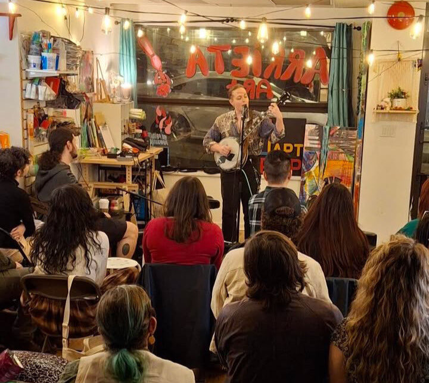

## Upcoming Shows:
 
[Follow on Instagram](https://www.instagram.com/ruffledbirdling/) for upcoming show announcements. Contact for booking.

## Past Shows:

### 2025:

Nov 27 - [New & Known](https://www.instagram.com/p/DRdQAAHki19/) featured performer, Green Auto, Vancouver  

Oct 9 & 16 - [New West Farmers Market](https://newwestfarmers.ca/) [(Event Post)](https://www.instagram.com/newwestfarmers/p/DPwc5l0iQF-/)  

Oct 6 - [SATELLITE: Harvest Moon](https://www.eventbrite.com/e/satellite-harvest-moon-tickets-1579384996039), Patchbay Fieldhouse, Vancouver  

Sept 14 - [Car Free Day Main St](https://www.carfreevancouver.org/), Vancouver  

Sept 13 - [Salmon Creek Mural Celebration](https://stillmoonarts.ca/2025-renfrew-ravine-moon-festival/mf25-salmon-mural/), Renfrew Ravine Moon Festival, Vancouver [(Eventbrite)](https://www.eventbrite.ca/e/salmon-creek-mural-celebration-tickets-1564362112189)  

August 1 - Open Air Performance Series, [Evergreen Cultural Centre](https://evergreenculturalcentre.ca/events/open-air-2025-dominic-grimm/), Coquitlam [(Do604)](https://do604.com/events/2025/8/1/open-air-performance-series-dominic-grimm-tickets)

July 20 - [Show Your Rainbows](https://www.instagram.com/p/DLg9ibhu4g5/), Patchwork Repair Hub, Slocan Park, Vancouver [(Eventbrite)](www.eventbrite.ca/e/show-your-rainbows-tickets-1442129621519)  

July 19 - Collingwood Days, Gaston Park, Vancouver  

June 16 - [Open Mic](https://www.instagram.com/open.mic.night.1/) featured performer, DCTRL, Vancouver 

March 1 - [APT Pop](https://www.instagram.com/aptpop/), [Arrieta Studios](https://www.instagram.com/arrieta_art/), New Westminster  

### 2024:

Dec 14 - [Songs in the Snow](https://historicsteveston.ca/a-steveston-favourite-returns-in-december/), Steveston Historical Society, Richmond  

Dec 7 [APT Pop](https://www.instagram.com/aptpop/) at [Arrieta Studios](https://www.instagram.com/arrieta_art/), New Westminster  

Oct 5 - EcoRise Fest, Vancouver  

Sept 14 - Tea, Tunes, and Verse in the Garden, [Renfrew Ravine Moon Festival](https://stillmoonarts.ca/2024-renfrew-ravine-moon-festival/2024artists/), Vancouver  

July 7 - [Cross & Crows Books Fundraser](https://crossandcrows.com/), Vancouver  

June 23 - Summer Solstice Talent Show, Vancouver  
